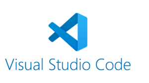
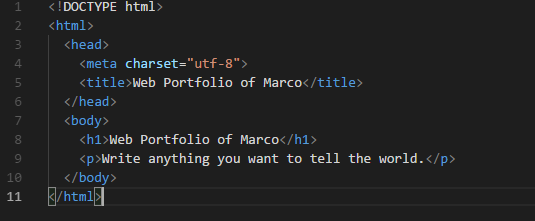
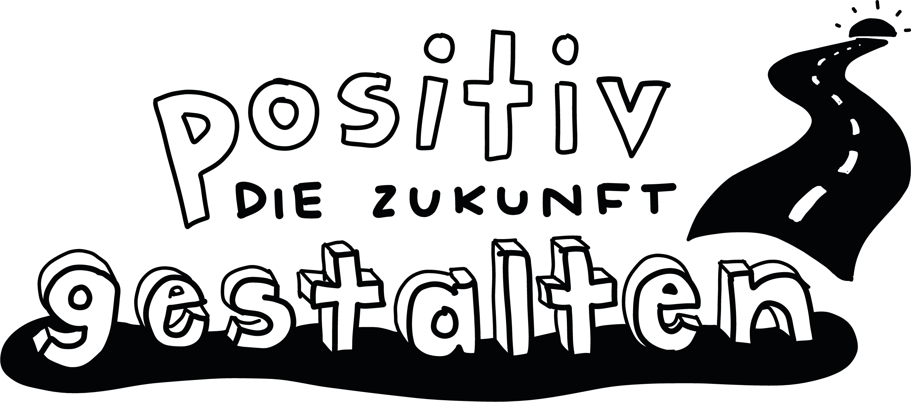

+++
title = "Achtung! Fertig! Los! Programmieren"
date = "2021-10-19"
draft = false
pinned = false
image = "pro.jpg"
description = "Heute fiel der Startschuss zum programmieren! Mit grosser Vorfreude und Elan sind wir ins programmieren Eingestiegen und haben unsere erste Webseite von Grund auf erstellt."
+++
# Der Startschuss zum Programmieren

Nach einem kurzen Fachinput von Marco konnten wir direkt selbst loslegen. Nachdem wir den notwendigen Zip Ordner heruntergeladen haben, konnte man nach dem entpacken direkt mit Visual Studio programmieren beginnen.

Da wir natürlich alle keine Ahnung von programmieren hatten, konnte wir uns die Basics mithilfe von Marco seinen Lernblog selbst beibringen. [Hier zu Seite:](https://code.makery.ch/library/html-css/)

Zuerst lernten wir, wie die Grundbausteine einer Webseite lauten. In Visual Studio sah das bei mir wie folgt aus:

Nun konnten wir selbstständig Schritt für Schritt uns durch die verschiedenen Teile durcharbeiten. Ich war etwas schneller, weshalb ich den meisten etwas voraus bin.

Bezüglich unseres Projektes, sind Moritz und ich eine Stunde früher gegangen, um Kunden zu finden. Wir kommen immer auf einen bessern Weg.

Wir haben nun diverse Ideen und Freuen uns auf die Zukunft! Ein Ziel ist in Sicht!

