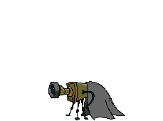
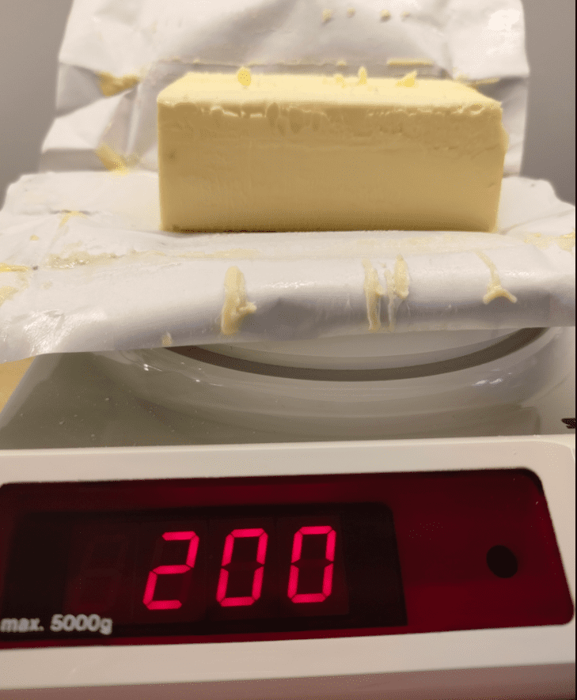
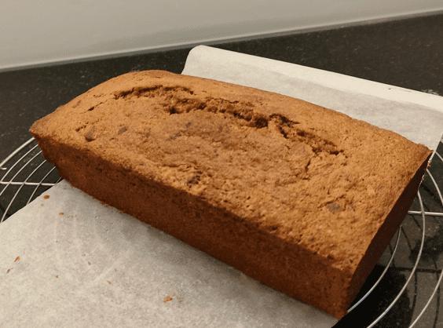
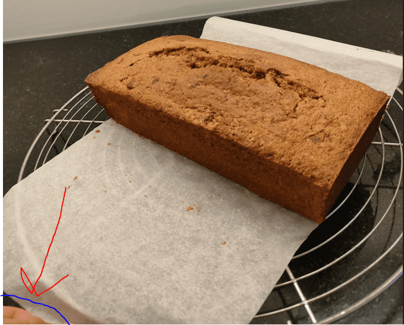

+++
title = "Backe back Kuchen!"
date = "2021-11-30"
draft = false
pinned = false
image = "zwm.gif"
description = "Heute habe ich mich mit meiner Kundin getroffen, um erste Fotos vom backen zu machen. Mit grosser Freude habe ich mich heute zu ihr begeben um einen Rotweinkuchen zu backen."
+++
# Habe ich Kuchen gehört?

Ja, genau richtig gehört, in meinem heutigen Blogeintrag geht es um Kuchen. Bei dem Kuchen handelt es sich um einen Rotweinkuchen. Ich habe mich am Dienstagnachmittag mit einer Freundin getroffen, damit ich Üben kann Fotos von Backwaren zu machen.

Netter Weise konnte ich den Unterricht früher verlassen um mein Vorhaben in die Realität um zu setzten. Als ich an kam begannen wir bereits voller Freude mit dem backen. Tatkräftig habe ich mit angepackt und sie immer wieder unterbrochen um ein Foto zu machen. Ich begann bereits während dem zubereiten mit fotografieren, da mir die Idee kam im Nachhinein ein Making Off zu machen.

")

Danach haben wir begonnen Stück für Stück nach dem Rezept zu arbeiten. Immer wieder habe ich kurz mein Handy in die Hand genommen um ein Foto zu schiessen.

Nach ein paar mehr Schritten hatten wir endlich einen Teig welchen wir in die Form giessen konnten. Während des ganzen Prozesses habe ich auch immer wieder Videos aufgenommen um eventuell später noch ein kleines Video zu drehen. Die Videos kann ich hier leider nicht einfügen.

Nach dem Backen hatten wir nun endlich einen fertigen Kuchen. Ich war sehr erfreut und wollte den Kuchen nun endlich abblitzen. Das Ergebnis sehr ihr hier: 

Das Fotografieren hat mir echt spass gemacht! Natürlich muss ich zugeben das es nicht all zu professionelle Fotos sind, jedoch bin ich mit dem Resultat trotzdem sehr zufrieden. Ich muss aber ehrlich gesagt zu geben das ich es mir leichter vorgestellt habe. Man muss auf so viele Dinge achten: Hintergrund, Licht, Positionierung, Winkel und vieles mehr. Jedoch muss ich trotzdem sagen das ich finde das meine Fotos gelungen sind! Natürlich sind auch mir Missgeschicke passiert:

Ich bin sehr erfreut darüber, dass ich nun bei meinem Projekt endlich etwas Handfestes in den Händen habe, oder besser gesagt auf dem Computer. Ich bin gespannt was ich alles noch bezüglich meines Projektes erleben werde und muss festhalten, dass mir dieser Nachmittag grosse Freude bereitet hat.

Am Schluss haben wir den Kuchen natürlich auch noch gegessen und er hat mindestens so gut geschmeckt wie meine Fotos aussehen ;)

Nächste Woche bereite ich mich auf meine Programmierprüfung vom 14. Dezember vor...

Bis bald...