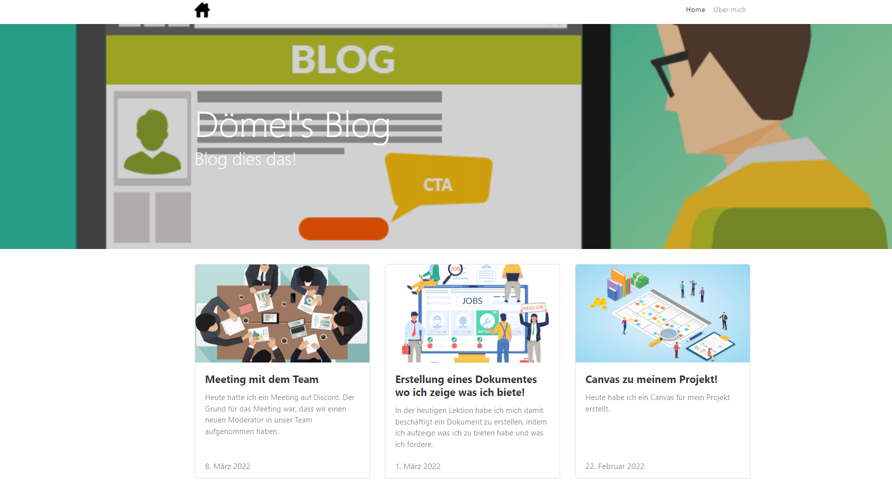

+++
title = "Blog Einführungslektion"
date = "2022-03-29"
draft = false
pinned = false
image = "images.jpg"
description = "Heute habe ich zusammen mit Samira eine Einführung in der BG Klasse, bezüglich Blogeinträgen gemacht. Wir haben ihnen gezeigt wie man den Blog einrichtet und dazu noch dies Basics bei erstellen eines Eintrages vermittelt."
+++
# Einführung Blogeinträge

Letzte Woche wurden wir von Marco gefragt, ob wir Lust hätten der BG Klasse zu erklären, wie man den Blog einrichtet und wie man dazu passende Einträge erstellt.  Nach kurzer Überlegung habe ich mich dazu entschieden, dieser Anfrage nachzukommen und so habe ich heute die Einführung gemacht:

Samira war so nett mich beim Auftrag tatkräftig zu unterstützen und so konnten wir die Lektion gut planen und durchführen. 

Als erstes haben wir ihnen den Lernblog von Marco gezeigt, wo sie die Anleitung auffinden konnten. Anschliessend liessen wir sie den Blog installieren. Dabei traten einige Schwierigkeiten auf. Einerseits erhielten die Schüler die Bestätigungs-Mail von Netlify nicht erhalten haben. Nachdem wir vorerst selbst versucht haben das Problem zu lösen, haben wir Rücksprache mit Marco genommen, der uns dann zeigen konnte wie man das Problem lösen konnte. Die Lösung war, dass man auf "Forgot Passwort" klickt, um so ein neues Passwort zu generieren.

Anschliessend nachdem alle ihren Blog eingerichtet hatten, konnten wir noch die Benutzer Oberfläche des Blogs erklären. Zudem haben wir noch einige eigene Beispiele gezeigt.

Als alles erklärt war und alle Fragen geklärt waren, haben wir unsere Sieben Sachen gepackt und sind gegangen. Als kleines Dankeschön hat Herr Veraguth einen Lindt Schokohasen überreicht.

Nächste Woche muss ich mich darum kümmern, noch einen zweiten Kunden für mein Projekt zu finden. Ich nehme mir vor dies nächsten Dienstag in Angriff zu nehmen.

Ich bin gespannt, wie schnell es mir gelingen wird, einen zusätzlichen Kunden zu finden

Bis Bald