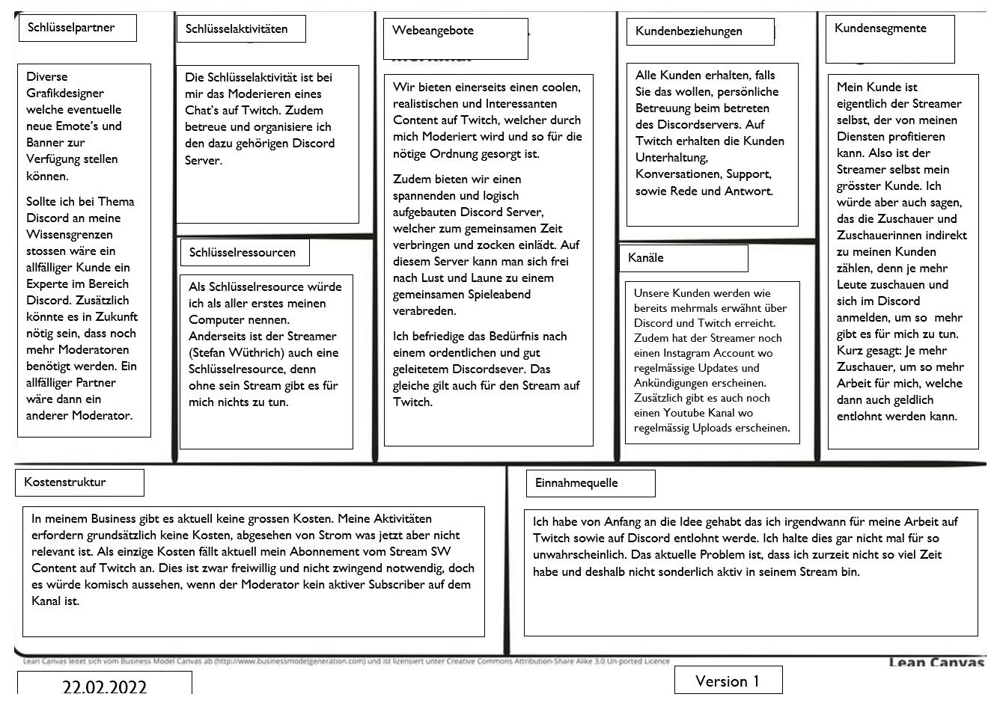

+++
title = "Canvas zu meinem Projekt!"
date = "2022-02-22"
draft = false
pinned = false
image = "canvas.jpeg"
description = "Heute habe ich ein Canvas für mein Projekt erstellt."
+++
# Was ist ein Canvas?

Wir haben das Business Model Canvas schon öfters in der Schule behandelt, doch viele von euch sagt das vielleicht nichts. Deshalb hier eine kurze Erklärung:

Das Business Model Canvas (kurz: BMC) ist ein Framework für die Visualisierung und Strukturierung von Geschäftsmodellen. Das Framework wurde vom Schweizer Alexander Osterwalder entwickelt und im Jahre 2008 im [Buch Business Model Generation](https://digitaleneuordnung.de/out/Business-Model-Generation) veröffentlicht. Seitdem erfreut es sich bei der strategischen Planung und Entwicklung von Geschäftsmodellen großer Beliebtheit.

Ich fand es heute sehr spannend das Canvas zu erstellen und habe mir bei diversen Punkten auch lange Gedanken gemacht. Mein erstelltes Canvas seht ihr hier: 

Ich habe versucht mein Projekt so gut es geht im Canvas darzustellen. Bei einigen Punkten sind noch diverse Veränderungen möglich und ich bin mir sicher das das nicht die letzte Version war.