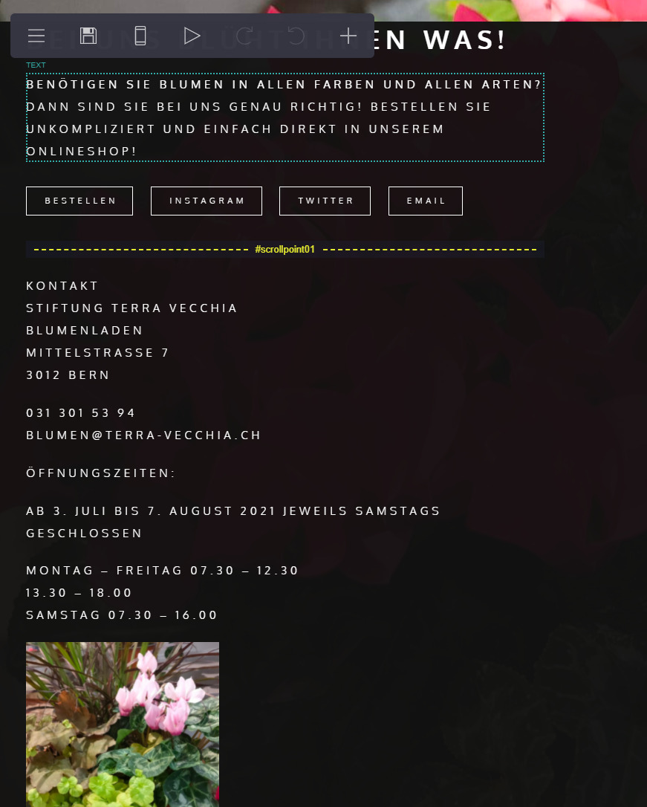
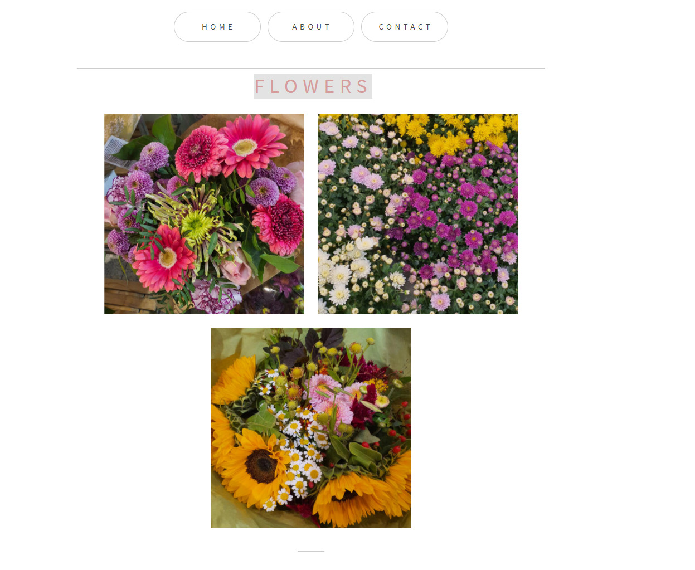

+++
title = "Der erste Blog"
date = "2021-08-24"
draft = false
pinned = false
image = "blogblog.gif"
description = "Meine Eindrücke und Erlebnisse der ersten WEB-Lektion!"
+++
# **Erfahrungen und Erlebnisse mit Webseitenprojekt**

Heute hatten wir zum ersten Mal das Freifach WEB. Mit grossen Erwartungen und Freude bin ich in diesen Dienstagnachmittag gestartet.

Als erstes wurde geschildert wie die Unterrichtseinheiten jeweils ablaufen werden. Ich fand es sehr interessant und bin gespannt was wir alles noch lernen und erleben werden. 

Nach der Einführung erhielten wie die Möglichkeit mit Carrd.co einen eigene erste Website zu erstellen. 

Anfänglich hatte ich grössere Schwierigkeiten mit dem Tool umzugehen, da ich mich zu erst etwas zurecht finden musste. Nach einigem Hin und Her klicken konnte ich dann meine eigene kleine Website präsentieren, die ich selbst erstellt habe.

 

Milo und ich konnten uns gegenseitig gut ergänzen. Als erstes sind wir im Coop zum Blumen laden gegangen um dort diverse Blumen ab zu fotografieren. Anschliessen sind wir zusammen im Zimmer 211 zusammengesessen und haben unsere Website erstellt. 

Darauffolgend haben wir uns die Präsentationen der anderen Gruppen angehört und selber noch kurz unsere Website vorgestellt. Ich fand es sehr interessant wie kreativ die anderen Gruppen waren.

Im Nachhinein muss ich aber sagen das ich das erstellen der Website eher langweilig fand, da es für mich etwas zu einfach und nicht all zu komplex war. Ich bin aber fest davon überzeugt das es in Zukunft noch etwas komplexer und spannender wird.

**Deshalb freue ich mich auf die nächste Lektion und bin guter Dinge das ich noch einiges lernen kann!**

