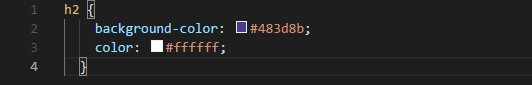

+++
title = "Die Skills im Programmieren werden immer besser"
date = "2021-10-26"
draft = false
pinned = false
image = "programmieren_lernen.jpg"
description = "In der heutigen Lektion konnten wir an unserer ersten Webseite weiterarbeiten, welche wir von Null an gestartet haben."
+++
# Tutorial Teil 3 bis 6

Heute erhielten wir wieder 2 Lektionen Zeit unsere individuellen Programmierkünste zu verbessern. Ich setzte mit meiner Webseite dort fort wo ich letztes Mal aufgehört habe. Nachdem ich kurz mein Wissen wieder aufgefrischt hatte konnte ich direkt wieder Vollgas loslegen.

Im Tutorial Nummer 3 habe ich eine Einführung in CSS erhalten. Mit CSS hat man die Möglichkeit eine Webseite optisch anschaulicher zu gestalten und zum Beispiel mit Hex Farben Codes die Farben zu ändern. Das sieht dann wie folgt aus:

In Tutorial 4 wurde mir gezeigt wie man mittels Rechtsklick und untersuchen im Web diverse Dinge des Codes der Webseite ändern kann. Dies kannte ich bereits deshalb empfand ich dieses Tutorial eher als langweilig.

In Tutorial 5 habe ich gelernt, wie man weitere Seiten hinzufügen kann und anschliessend in Tutorial 6 gelernt wie man dann die passenden Schaltflächen dazu erstellt. Dies habe ich mit den folgenden Zeilen gemacht:

Nach den ersten 6 Tutorial sieht meine Webseite wie folgt aus:

## Wie geht es in unserem Projekt weiter?

Nach einem harzigen Start beginnt unser Projekt immer mehr in Schwung zu kommen. Wir haben immer mehr potentielle Kunden im Blick.

Nächstes Mal werden wir uns damit befassen unser Projekt weitervoran zu treiben. Bis bald!

