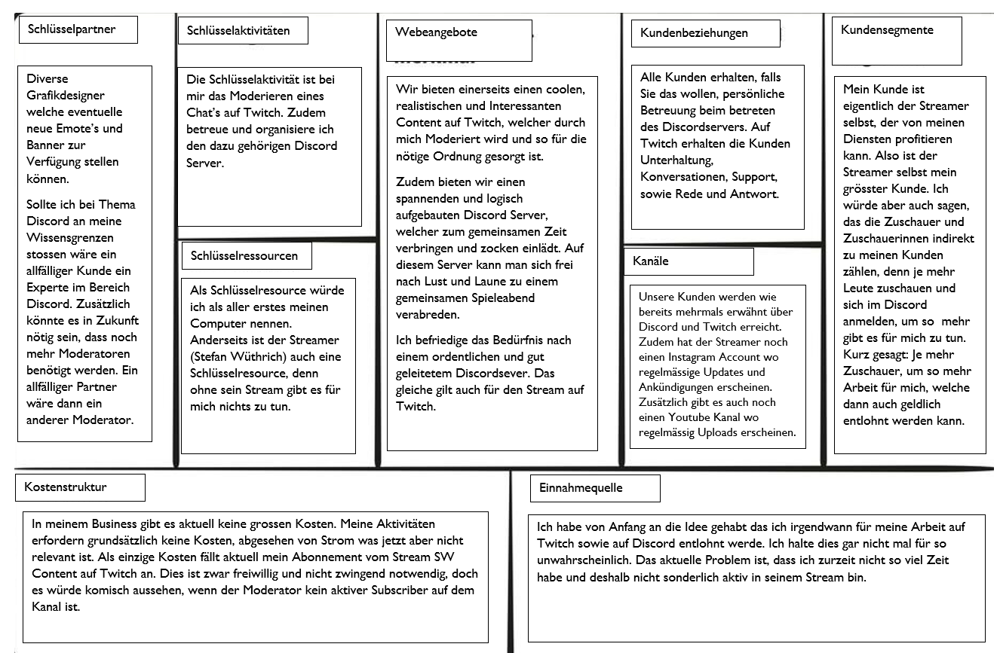
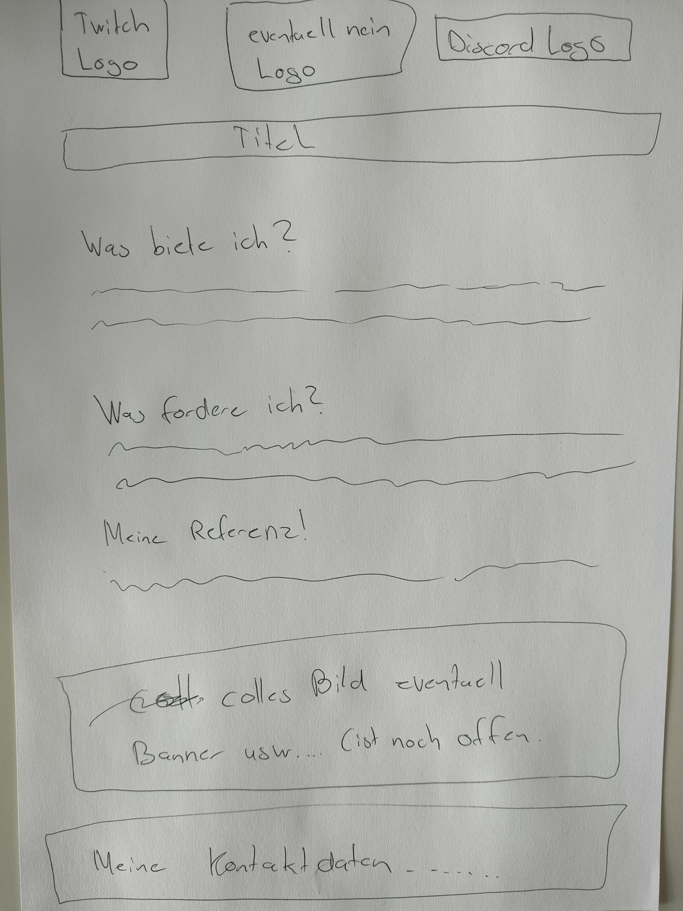
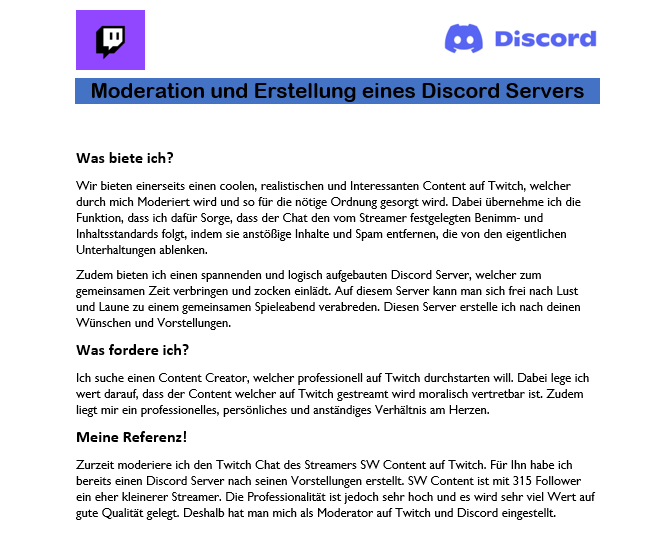

+++
title = "Erstellung eines Dokumentes wo ich zeige was ich biete!"
date = "2022-03-01"
draft = false
pinned = false
image = "istockphoto-1252679616-612x612.jpg"
description = "In der heutigen Lektion habe ich mich damit beschäftigt ein Dokument zu erstellen, indem ich aufzeige was ich zu bieten habe und was ich fordere."
+++
# Stellenanzeige oder was?

Als ich heute mein Dokument erstellt habe kam es mir kurzzeitig so vor als würde ich eine Stellenanzeige erstellen. 

Am heutigen Nachmittag hatten wir besuch von einem Herren, welcher mit dem Gedanken spielt das Fach WEB im nächsten Jahr von Marco zu übernehmen. Ich hatte anschliessen ein kleines Meeting mit dem Herren und Marco. In diesem Meeting habe ich mein überarbeitetes Canvas, nochmals mit Marco besprochen.

Als Marco währenddem Meeting kurz weg war habe ich dem Herren mein ganzes Projekt vorgestellt. Dabei hatte ich das Gefühl, dass ihm mein Projekt sehr gefallen hat und er es sehr spannend war. Als Ergebnis des Meetings haben wir festgehalten, dass es schlau wäre ein Dokument zu erstellen, wo ich zeige was ich denn alles bieten würde. Dies habe ich dann anschliessend auch von zu Hause aus in angriff genommen.

Als erstes habe ich eine kleine Skizze zu diesem Dokument erstellt, welche wie folgt aussah:

Anschliessend habe ich ein Word Dokument erstellt, wo ich meine Ideen umgesetzt habe. In diesem Dokument bin ich aber noch nicht ganz fertig geworden. Ich denke das ich dieses Dokument nächsten Dienstag fortsetzen werde.

Der aktuelle Stand des Dokumentes sieht so aus:

Ich glaube ich habe konnte heute einige spannende Ideen sammeln und kann mein ganzes Projekt immer mehr verschriftlichen. Ich bin gespannt wo mich das ganze noch hinführen wird....

Bis bald!

