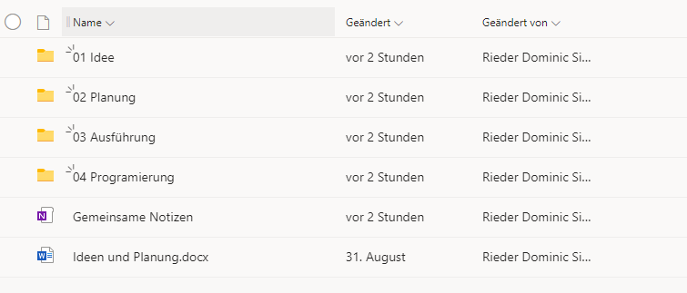
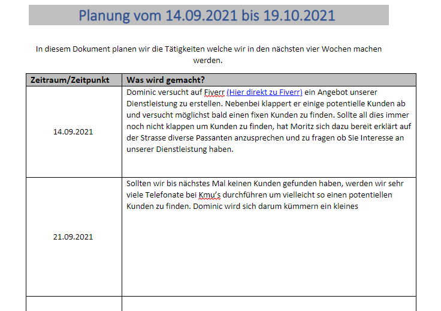

+++
title = "Feinschliff und erste Schritte"
date = "2021-09-14"
draft = false
pinned = false
image = "feinschliffff.jpg"
description = "Heute ging es an die Umsetzung. Ich musste an einigen Ideen noch etwas schleifen und habe zusätzlich viele Telefonate um eventuell Kunden zu finden."
+++
# Feinschliff und erste Schritte

Heute musste ich die vier Lektionen WEB leider alleine in Angriff nehmen da Moritz einen Termin hatte.

Zu Beginn der Lektion haben wir eine kurzes Standup-Metting abgehalten, wo alle kurz erzählt haben auf welchem Stand sie sich befinden. Danach konnte man selbstständig an unserem Projekt arbeiten.

Ich habe mir heute vorgenommen die Ordnerstruktur in unserem eigenen Team herzustellen und eine kleine Planung auf die Beine zu stellen.

Ein weiterer Punkt den ich heute noch abarbeiten wollte war unseren eigenen Fiverr Account zu erstellen. Es viel mir sehr leicht diesen zu erstellen. Doch nachdem erstellen des Accounts stellte ich fest das es praktisch wäre wenn man bereits eine getätigte Arbeit hätte welche man präsentieren könnte und mit der man für sich werben könnte. Deshalb nehme ich mir für das nächste Mal vor ein kleine Präsentationswebseite zu erstellen.

Vielleicht fragt ihr euch was Fiverr ist: Bei **fiverr**.com und tennerr.de handelt es sich um Plattformen, auf denen jeder digitale Dienstleistungen anbieten kann, z. B. Grafik und Design, Texterstellung, Übersetzung, Videoschnitt, Tonaufnahmen etc.

Zudem habe ich heute einige Telefonate bei bekannten und Freunden getätigt, um allen falls Personen zu finden die Interesse an unserer Dienstleistung haben könnten. Leider waren diese Telefonate nicht besonders Erfolgreich. Oft sind mir vom Thema abgekommen und haben uns mehr über das private Leben ausgetauscht als über das weshalb ich eigentlich angerufen habe.

Im Grossen und Ganzen bin ich sehr zufrieden mit den heutigen 4 Lektionen. Ich konnte so gut wie alles abarbeiten was ich mir vorgenommen habe. Ich bin sehr gespannt, ob es auf Fiverr überhaupt jemanden gibt, der Interesse an unserer Dienstleistung hat. 

Ich denke das es ein sehr cleverer Schachzug von mir war die Planung zu erstellen. Erstens weis Moritz was ich heute gemacht habe und zweitens wissen wir beide woran wir nächste Woche weiterarbeiten können.

Leider konnten wir immer noch keinen Kunden finden, aber ich bin guter Dinge das wir bald jemanden finden werden...

