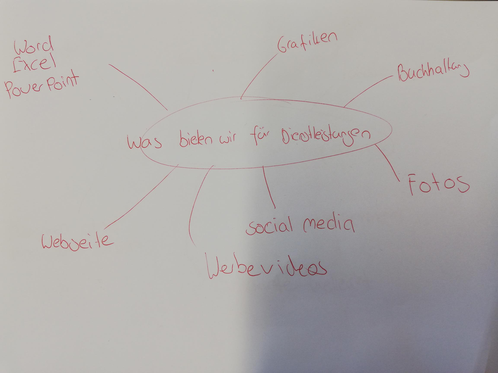
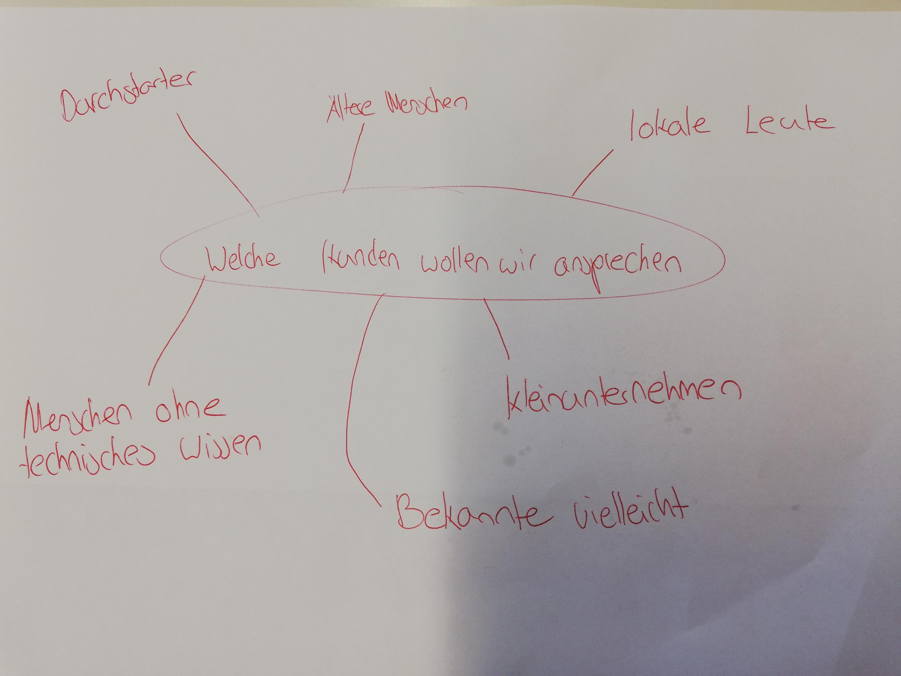

+++
title = "Geschäftsideen und viel Denkarbeit"
date = "2021-08-31"
draft = false
pinned = false
image = "joi.png"
description = "Heute stand Nachdenken und ausarbeiten an!"
+++
# **Denken, denken und denken!**

Bereits während der ganzen letzten Woche habe ich mir den Kopf darüber zerbrochen wo sich in meinem Umfeld potenzielle Kunden befinden könnten. Mir kamen einige Ideen in den Kopf welche ich auch schon in einer kurzen Sitzung mit Marco (Lehrer) und Moritz austauschen konnte.

Zu beginn der heutigen Lektionen haben wir uns in unseren neu gegründeten zweier Teams zusammen gefunden. Mein Teampartner ist Moritz Brechbühl. 

Wir haben uns kurz zusammen gesetzte und ein kurzes Brainstorming gemacht, wo wir unsere Ideen zusammen fassen konnten. Ich fand es sehr interessant da man seinen Kopf wirklich anstrengen musste um gute Ideen auf das Papier zu bringen. Hier könnt ihr unsere Beiden Mindmaps sehen:

Schlussendlich muss man sagen das wir noch keinen Konkreten Weg eingeschlagen haben. Dies Taten wir aber bewusst da wir bis jetzt leider noch keinen Kunden finden konnte. Wir sind jedoch auf der Suche. Ich habe viele Ideen in meinem Kopf, welche ich auch erfolgreich bei einem kleinen Gespräch mit Marco austauschen konnte. Ich denke wir können in naher Zukunft noch gross durchstarten!!!

Ich bin gespannt was alles noch passieren wird und mit was für Menschen wir noch in Kontakt treten können. Die heutige Lektion hat mir grosse Freude bereitet, da man seinen Gedanken freien Lauf lassen konnte und man wirklich sehr kreativ sein.

Ich freue mich auf die nächste Lektion und bin gespannt was dieses Jahr alles im WEB noch passieren wird...

