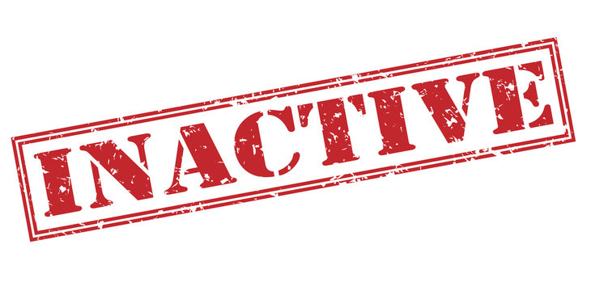
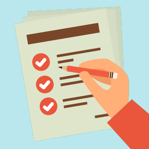

+++
title = "Meeting mit dem Team"
date = "2022-03-08"
draft = false
pinned = false
image = "istock-885469174.jpg"
description = "Heute hatte ich ein Meeting auf Discord. Der Grund für das Meeting war, dass wir einen neuen Moderator in unser Team aufgenommen haben. "
+++
# Zusammenfassung vom Meeting vom 8. März!

Am heutigen Nachmittag habe ich den Unterricht früh zeitig verlassen. Dies tat ich aus dem Grund, dass ich ein Meeting hatte. Der Anlass dazu war, dass wir einen neuen Moderator in unser Team aufgenommen. Meine Aufgabe war es, dem neuen Moderator all seine Aufgaben zu erklären. Der Moderator ist ausschliesslich für Twitch  zuständig. Für das Aufgabengebiet auf Discord bin ausschliesslich ich zuständig.

Das Meeting hat gute 40 Minuten gedauert. Zuerst haben wir uns nochmals kurz gegenseitig Vorgestellt. Anschliessend habe ich Ihm seine Aufgaben erklärt. Die Aufgaben lauten wie folgt:

1.  aktiv am Chat teilnehmen
2. Chat moderieren
3. Sich bedanken für Subs, Bits, Donations etc
4. Fragen beantworten
5. Anfragen bezüglich Kanalpunkten bearbeiten
6. Suspekte User bannen
7. Dafür sorgen, dass Regeln eingehalten werden

   Der Moderator wurde aufgrund meiner aktuellen Inaktivität eingestellt. Ich habe zurzeit Abschlussprüfungen und habe deshalb nicht viel Zeit aktiv im Stream zu sein.

   

   Nach dem Meeting gab es dann noch eine Besprechung bezüglich des Discord Servers. Stefan Wüthrich (Der Streamer) hat mir diverse Punkte gesagt, die ich gerne auf seinem Discord Server hinzufügen soll. Die anpassungen Lauten wie folgt:

* Eigener Channel für Moderatoren
* Join System anpassen
* Bot mit Belohnungssystem einführen
* Rollen Überarbeitung

Diese Aufgaben muss ich in naher Zukunft nach gehen, damit ich seine Wünsche erfüllen kann. Ich denke ich werde nächsten Dienstag den Unterricht frühzeitig verlassen, um die Aufgaben auf Discord zu erfüllen.

Bis bald!