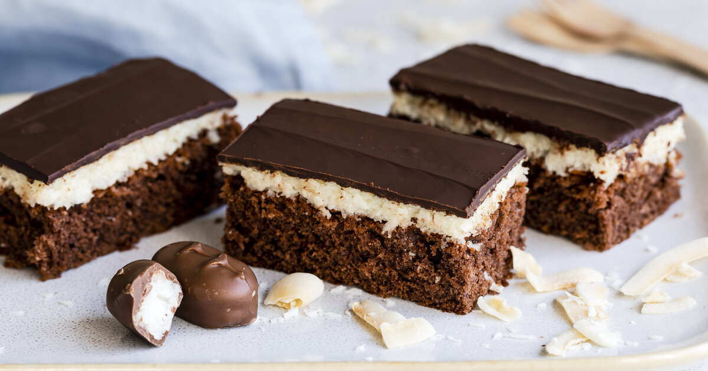
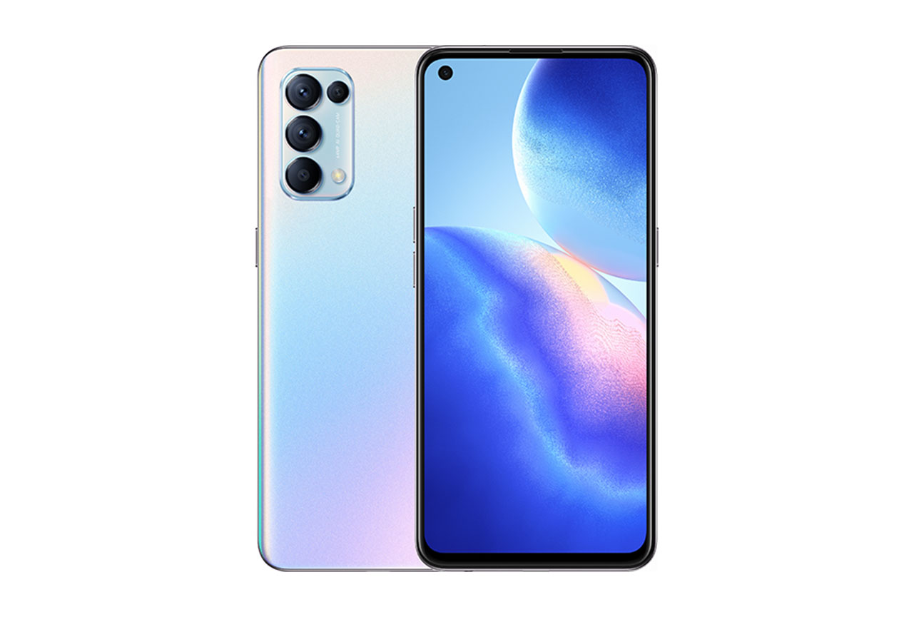

+++
title = "Mein Projekt hat endlich Schwung bekommen!"
date = "2021-11-16"
draft = true
pinned = false
image = "giphy.gif"
description = "Ich habe nun endlich eine Kundin gefunden. Voller Freude erzähle ich euch heute wie ich meinen ersten tatsächlichen Kunden finden konnte!"
+++
# Wie finde ich einen Kunden?

Diese Frage habe ich mir nun lange genug gestellt, doch endlich habe ich einen Kunden gefunden. Ihr fragt euch nun sicherlich alle wie ich einen Kunden gefunden habe und was den nun genau mein Projekt ist. Ich werde es euch nun erzählen:

Wie es im Leben halt so ist, scheinen Dinge oft schwieriger als sie wirklich sind. So war es auch bei meinen Projekt. Nach etlichen versuchen und diversen verschieden Versuchen hat es endlich klappt. Wie es der Zufall so will, war es wieder mal durch Vitamin B. Eine Freundin von mir, meinte zu mir, dass sie gerne eine Webseite hätte auf der man ihre Backkünste bewundern kann. Ich fand es als sehr gute Möglichkeit für mein Projekt.

Am Dienstag dem 9. November habe ich mich mit ihr getroffen, um die Details des Projektes zu besprechen. Sie sagte das Sie gerne eine Webseite mit teilweise eigenen so wie aber auch Bilder aus dem Netz haben will. Die Webseite soll schön aber schlicht sein. Sie hätte gerne eine Navigationsleiste mit z.B. Galerie & Rezepte. Sie hatte auch noch die Idee einen kleinen Werbeclip oder ein schönes Video herzustellen. Natürlich erwartet Sie nicht all zu hohe Qualität. 

Nun habe ich für den 16 November einen Termin zum fotografieren abgemacht. Ich werde mir mühe geben und bin gespannt wie das Ergebnis sein wird. Ich werde versuche Fotos wie auch Videos zu machen.

Als Kamera werde ich mein normales Handy brauchen, da ich es gerne nur mit Mitteln machen will die mir persönlich zur Verfügung stehen! 

