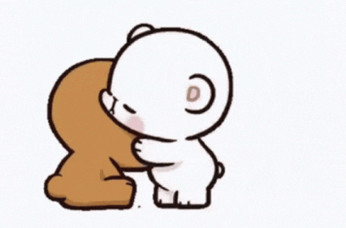

+++
title = "Namensfindung, Webseitengestaltung und vieles mehr..."
date = "2021-09-21"
draft = false
pinned = false
image = "heeeee.gif"
description = "Heute war ich zum zweiten Mal in Folge alleine. Ich habe mich heute, um das erstellen unserer eigenen Webseite gekümmert. Dazu musst ich mir einen Firmennamen und überlegen und diverse andere Überlegungen tätigen. Dies und vieles mehr erfahrt Ihr im heutigen Blog..."
+++
# Denken, umsetzten und ausarbeiten

Zu beginn der heutigen Lektion, hielten wir wieder ein kurzes Standup-Meeting, wo unterandrem jede Gruppe erzählt hat, was seit dem letzten Mal passiert ist, was heute passiert und welche Hindernisse und Schwierigkeiten es gibt.

Als ich nachdem kurzen Meeting wieder am Tisch sasss, wusste ich zuerst nicht was ich jetzt machen soll. Ich habe zwar eine Planung für heute erstellt doch, diese konnte ich nicht wirklich gebrauchen. Nach einigen Minuten überlegen kam mir die Idee. Mir kam in den Sinn, dass wir noch etwas brauchen womit wir unsere Arbeit repräsentieren können, deshalb habe ich mich dazu entschieden eine kleine Webseite zu erstellen.

Ich erstellte die Webseite wieder mit Carrd.co. Bei der Namensfindung entschied ich mich für den Namen **Website4You.** Nun benötigte ich auch noch en Logo, welches ich mit logomaker.com kreiert habe.

Anschliessend habe ich einen Twitteraccount erstellt, einen ersten Tweet verfasst und mit der Carrd Webseite verknüpft.

Zudem habe ich es auch mit meiner BWD E-Mail Adresse verknüpft.

Nun,  da ich viele einzelne Komponenten hatte, konnte ich alles zu einer finalen Webseite vereinen. Ich muss mir ehrlich eingestehen, dass ich sehr viel spass bei all diesen kleinen Schritten hatte. Ich fühlte mich irgendwie sehr kreativ und voller Energie habe ich die Webseite in kürzester Zeit erstellt. Hier der Link zu Webseite: [website4you.carrd.co](website4you.carrd.co)

#### Leider gibt es auch negative Dinge zu erzählen:

Wir konnten tragischerweise bis heute, immer noch keinen Kunden finden. Dies macht mich nicht sehr glücklich deshalb werde ich bis zum nächsten Mal alles daran setzten einen Kunden zu finden. 

Von nun an werde ich in den Ferien sein, weshalb es in den nächsten 3 Wochen hier etwas ruhiger zu und her gehen wird...

Bis bald

