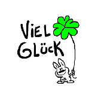

+++
title = "Programmierprüfung!"
date = "2021-12-14"
draft = false
pinned = false
image = "2.jpeg"
description = "Heute hatte ich meine Programmierprüfung, weshalb es nicht al zu viel zu erzählen gibt"
+++
# Programmieren leicht gemacht!

Heute hatte ich meine Programmierprüfung. Ich war sehr gespannt und habe mich gefreut, um heraus zu finden ob meine Kenntnisse reichen um eine gute Note zu erzielen. Mit grosser Freude und Motivation kam ich an diesem Dienstagnachmittag in das Fach WEB.

Marco teilt mir den Auftrag aus und wir klärten zuerst noch ein paar Unklarheiten, danach ging es direkt ans eingemachte. Ich hämmerte wie wild auf meiner Tastatur herum, wechselte von Anwendung zu Anwendung und googelte vereinzelt Dinge die ich nicht wusste. Der Auftrag ist mir sehr leicht gefallen, trotzdem war ich am Ende der Prüfung irgendwie nicht mit dem Resultat zu frieden, da mir die Webseite optisch einfach nicht gefiel. 

Meine fertige Webseite sah wie folgt aus:

Mit einem unguten Gewissen, gab ich meine Prüfung nach ein bisschen weniger als vier Lektionen ab. Im Nachhinein frage ich mich selbst wie ich dort knappe 4 Lektionen ohne Bewegungen sitzen konnte. Ich bin gespannt welche Note ich erhalten werde und freue mich aufs nächste Mal wo ich dann meine Note erhalte.

Auch nächste Woche wird es hier nicht viel zum lesen geben, da ich nächste Woche noch meinen Vortrag über mein Projekt habe!

Bis Bald!

