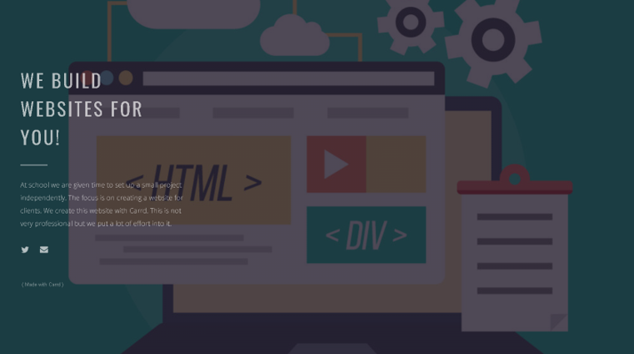
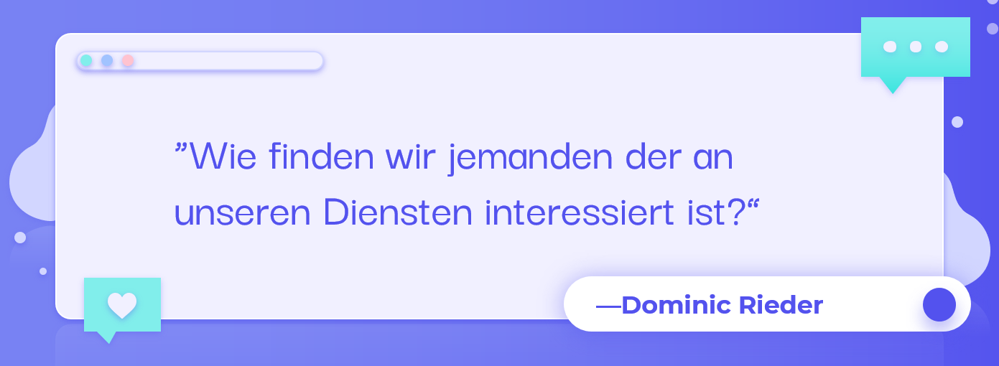
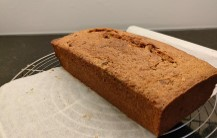

+++
title = "Projektbericht"
date = "2022-01-11"
draft = false
pinned = false
image = "bild1.png"
description = "Der heutige Blogeintrag ist etwas speziell, denn heute schreibe ich einen Projektbericht in Form eines Blogeintrages. Viel Spass!"
+++
# **Projektbericht vom Projekt WEB**

Zu Begin des Jahres startete ich in das Freifach WEB, welches ich mit grosser Freude angetreten habe. Mein Vorstellungen waren jedoch etwas anders. Ich dachte, dass mehr allgemein Programmiert wird. Trotzdem hatte ich sehr viel Spass im WEB und denke das ich mich auch bezüglich meiner Selbstständigkeit weiterentwickeln konnte. Doch wie fing alles an?

## Start und Ideenfindung

Am Anfang des WEB Modules musst man sich in zweier Gruppen zusammenfinden um dann gemeinsam ein Ziel in Form eines Projektes zu realisieren. Anfangs konnte ich mir nicht gross vorstellen in welche Richtung das ganze Projekt gehen soll und ich war um ehrlich zu sein auch bisschen überfordert, da ich selbst nicht sonderlich kreativ bin und grundsätzlich Aufträge mit klarer Struktur vor freien und selbständigen Arbeiten bevorzuge. Trotz alldem lies ich mich nicht herunterziehen und startet das Projekt WEB gemeinsam mit Moritz mit grosser Vorfreude.

Der Auftrag war es, einen Kunden zu finden der entweder eine Webseite benötigt oder eine bestehende zu verbessern. Der Auftrag klingt grundsätzlich recht simpel, ist aber schwieriger und komplexer als man denkt.

Ich startete damit, dass ich versucht habe einen potentiellen Kunden zu finden. Um jemanden zu finden habe ich diverse Telefonate gemacht, jedoch waren diese nicht sonderlich erfolgreich. Entweder hatten die Leute kein Interesse oder sie dachten ich will Ihnen etwas verkaufen. Das telefonieren stellte sich als nicht all zu erfolgreich heraus, deshalb habe ich erstmals damit begonnen für unsere "Organisation" einen Web Auftritt zu erstellen.

Als erstes habe ich mir einen Namen überlegt. Nach langem grübeln kam ich zum Entschluss, dass Website4you ein passender und cooler Name ist. Anschliessend habe ich mich um ein Logo gekümmert. Dieses habe ich auf einer Webseite im Internet von einem Computer erstellen lassen. Das Finale Logo sah wie folgt aus: 

Darauffolgend habe ich eine passende Webseite erstellt. Diese Webseite habe ich mit Carrd erstellt, da ich mich mit diesem Tool noch nicht sonderlich gut aus kannte und deshalb fand ich es praktisch um erste Erfahrungen mit Carrd zu sammeln. Der Screenshot für die fertige Webseite seht Ihr hier: 

Die Webseite habe ich ebenfalls mit einem selbst erstellten Twitter Account und meiner E-Mail Adresse verknüpft. Zur Webseite gelangt Ihr [hier](https://website4you.carrd.co/):

Als all dies getan war, hatte ich wieder genügend Zeit um Kunden zu finden, doch dies gestaltete sich deutlich schwerer als Gedacht. An dieser Stelle finde ich eine Folie von meiner PowerPoint Präsentation sehr passend:

Um ganz ehrlich zu sein ist es mir sehr schwer gefallen einen Kunden zu finden. Nach langem hin und her und einigen Versuchen einen Kunden zu finden habe ich die aktuelle Versuche eingestellt und mich von meinem Partner getrennt da wir beide unterschiedliche, neue Projekte verfolgen wollen. Als ich nach mehreren Lektionen immer noch keinen Kunden gefunden habe, hatte ich auf gut deutsch gesagt die Nase voll von der ewigen Sucherei ohne Erfolg. Deshalb versuchte ich nun mit Hilfe von Vitamin B einen passenden Kunden. Kurze Zeit nach meinen Bemühungen hatte ich endlich eine potentielle Kundin. Es handelte sich um eine Freundin von mir, welche meinte, dass sie ein gutes Projekt für mich hätte. Ich traf mich anschliessend mit ihr, um diverse Einzelheiten zu besprechen und zu diskutieren. Die Idee des fertigen Projektes lautet wie folgt: 

Sie meinte zu mir, dass sie regelmässig zum Spass backen würde. Nun kam mir die Idee das ich Fotos vom backen machen könnte und diese dann auf einer Webseite veröffentlichen könnte. Die Idee gefiel ihr super! So schnell ging es und plötzlich hatte ich eine Projekt. 

Kurze Zeit darauf hatten wir uns an einem Dienstagnachmittag zu einem Treffen bei ihr zu Hause verabredet, damit ich Fotos machen kann währenddem sie am backen ist. Eines der fielen Fotos blende ich Ihnen gerne hier ein: 

Da die meines Projekts erst kurz vor dem Dezember kam, hatte ich nach dem Fotoshooting nicht die Zeit eine passende Webseite zu erstellen. Deshalb wäre es meine Idee dieses Projekt im nächsten Semester fortzuführen. Meine Freundin war jedoch sehr mit den Fotos zufrieden und meinte zu mir das ich Talent beim Fotografieren habe. Wie ernst das jedoch gemeint war, weis ich bis heute nicht.

## Meine Noten im Wahlpflicht Fach WEB

Während meiner Zeit im ersten Semesters des Faches WEB habe ich mich bewusst für eine andere Notengebung als die anderen entschieden. In meinen Augen bin ich im Stand mit meinem können eine bessere Note als 5.5 zu erzielen, deshalb habe ich mich für die Notengebung anhand von 3 Prüfungen entschieden. Die erste Prüfung war eine Programmierprüfung in der ich eine 5.8 erzielt habe. Die zweite Prüfung war mein Vortrag über mein WEB Projekt in dem ich eine 5.6 erhalten habe. Die letzte Note setzt sich aus all meinen Blogeinträgen zusammen. Ich hoffe, dass ich mithilfe dieser Note wieder auf eine 6 im Durchschnitt komme. Wünscht mir Glück!

## Eigene Erfahrungen

Über das ganze Semester verteilt hatte ich grosse Freude am Fach WEB. Ich fand es sehr spannend sich mal auf eine andere Weise mit gewissen Themen auseinander zu setzten. Zudem war es eine gute Übung für meine Kreativität, welche sowieso ab und zu etwas zu kurz kommt bei mir. Damit meine ich, dass ich sehr unkreativ bin. Aufgrund meiner fehlenden Kreativität hatte ich zu beginn im Fach WEB auch etwas Mühe, denn es gestaltete sich für mich sehr schwer, mir zu überlegen was ich machen will und anschliessend zu entscheiden. Doch ich sah es als Herausforderung und war deshalb auch immer mit voller Energie dabei. 

Ich fand es sehr gut das man uns in gewisser Weise offen gelassen hat, in welche Richtung man gehen will. Dies fördert in meinen Augen die Selbstständigkeit und wie oben schon erwähnt die Kreativität. Das Marco sich immer wieder um den Stand unserer Projekt interessiert hat fand ich auch sehr gut, dies gab einem das Gefühl, dass es Marco interessiert was mir machen.

Kunden zu finden gestaltete sich wie oben schon erwähnt als sehr schwierig bei mir. Deshalb empfand ich es manchmal als etwas mühsam und anstrengend, dass man auf all seine Bemühungen immer absagen erhalten hat. Trotzdem denke ich das es einen gut aufzeigt, wie man manchmal einfach Geduld und Ausdauer haben muss um ans Ziel zu gelangen.

Ich bin der Meinung, dass das Fach WEB nichts für jeder Mann ist, denn man benötigt eine gewisse Selbstständigkeiten sowie ein gewisses Engagement. Ich habe viele Schüler im Unterricht beobachtet, welche nur die Zeit absitzen und möglichst oft einen Grund suchen, um irgendwie im Home Office zu arbeiten. Doch wenn man sich für Selbstständigkeit und eigen Verantwortung interessiert ist man im Wahlpflicht Fach WEB genau richtig. Im Fach WEB sind deinen Ideen und Vorstellungen keine Grenzen gesetzt. Deshalb würde ich das Fach WEB für Interessierte auf jeden Fall weiter empfehlen. Kommen wir nun zu meinem Fazit.

## Fazit

Im Grossen und Ganzen bin ich sehr zufrieden mit meinem ersten Semester im Fach WEB. Die Leistungsüberprüfungen sind mir sehr gut gelungen und ich hoffe das ich noch im Schnitt auf eine 6 kommen werde. Ich konnte mein Projekt erfolgreich durchführen und bin sehr gespannt was die Zukunft noch mit sich bringen wird. Über das ganze Jahr verteilt hatte ich immer grossen Spass und immer etwas zu lachen im Fach WEB. Ich denke es ist mir gut gelungen die Anforderungen an mich um zusetzten. Für ein Andermal würde ich mir vornehmen etwas gezielter und übersichtlicher zu arbeiten. Damit meine ich, dass ich öfters Notizen festhalten will und auch gezielter und geplanter nach einem Plan zu arbeiten.

## Zukunft

Für das zweite Semester habe ich mir vorgenommen ein weiteres cooles und spannendes Projekt zu realisieren. Als Unterstützung fusioniere ich mit Simone um für maximale Kompetenz in unserem Team zu sorgen. Wir sind beide sehr motiviert und freuen uns auf die gemeinsame Zeit. Ich bin fest davon überzeugt das es uns gelingen wird ein erfolgreiches Projekt zu realisieren. Ich bin gespannt wo hin uns unser Weg führen wird.

Dies war nun mein kurzer Projektbericht zum ersten Semester. Ihr werdet auf jeden Fall auch noch im zweiten Semester mit Blogeinträgen versorgt!

Bis Bald