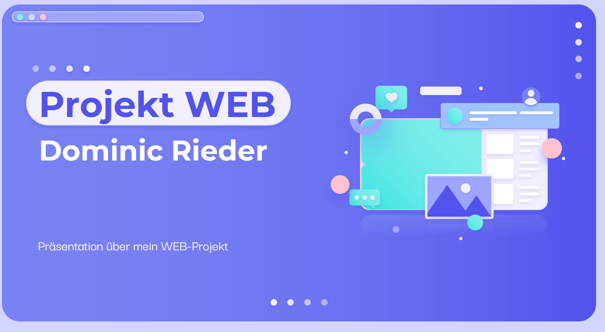
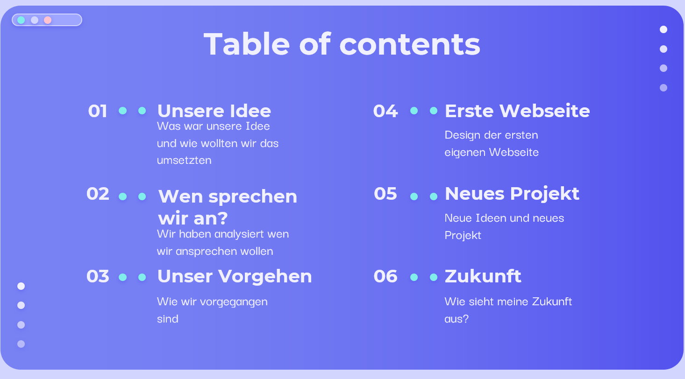
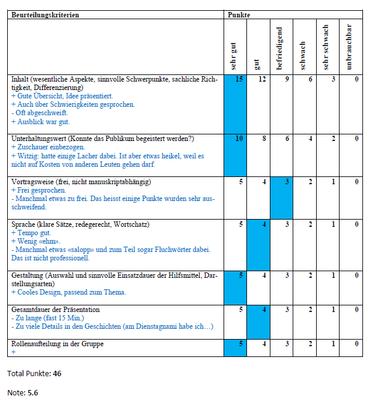
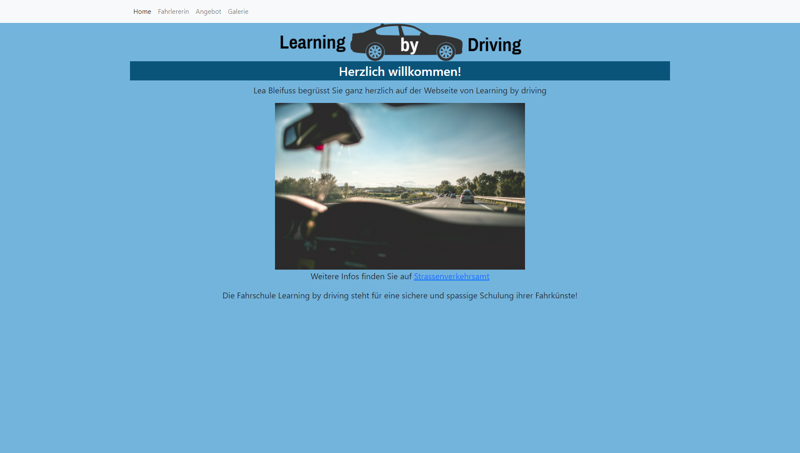
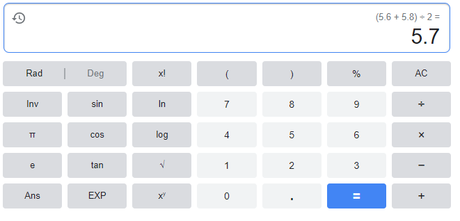

+++
title = "Präsentation über mein Projekt"
date = "2021-12-21"
draft = false
pinned = false
image = "powerpoint-praesentation-tipps-aufbau-inhalt.jpg"
description = "Heute hatte ich meine Webpräsentation, zudem habe ich meine Note für meine Webseite erhalten. Wenn du wissen willst welche Note ich habe, dann öffne nur den Blog und lies in durch. Viel Vergnügen!"
+++
# Meine Präsentation

Heute hatte ich meine Präsentation über mein WEB Projekt. Ich habe im vorhinein eine PowerPoint Präsentation erstellt, welche mir meiner Meinung nach sehr gut gelungen ist. Ich hatte sehr grosse Freude beim erstellen dieser PowerPoint. Das erste Mal ist es mir gelungen beim erstellen einer PowerPoint, dass sie optisch extrem gut aussieht. Normalerweise ist es bei mir so, dass ich zwar eine PowerPoint mit guten Inhalt, coole Animationen und spannenden Übergängen, aber letztendlich war sie optisch einfach nicht ansprechend in meinen Augen.

Das Titelblatt meiner Präsentation sah wie folgt aus:

In meiner Präsentation habe ich folgende Themen behandelt: 

Während meiner Präsentation war ich nicht nervös und ich finde das mir im grossen und ganzen eine sehr gute Präsentation gelungen ist. Nach meiner Präsentation habe ich ein Feedback erhalten, dass wie folgt aus sah: 

Mit der Bewertung bin ich einigermassen zufrieden auch wenn mir in meinen Augen für den selben Fehler in mehreren Kategorien Abzug gegen wurde. 

## Note meiner Webseite

Für meine Webseite habe ich die **Note** **5.8** erhalten, was mich sehr stolz macht und womit ich auch sehr zufrieden bin.

Nun habe ich aktuell 2 Noten im WEB: Eine 5.6 in der Präsentation und eine 5.8 in der Programmierprüfung. Das ergibt aktuell einen Schnitt von 5.7, was nicht meinen Erwartungen entspricht, denn mein Ziel ist es im WEB eine 6 zu erzielen. 

Meine letzte Note setzt sich als allen meinen Blogeinträgen zusammen, deshalb heisst es jetzt nochmals gas geben!

Bis bald und bleiben Sie gesund!

