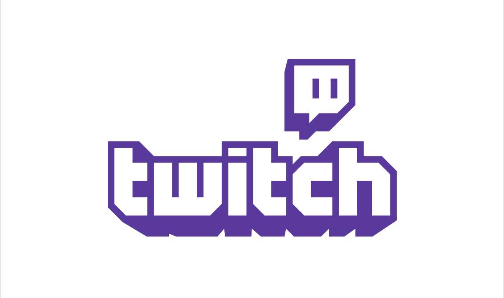
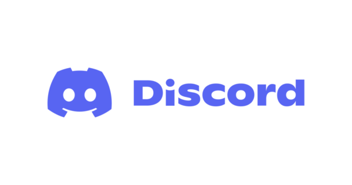
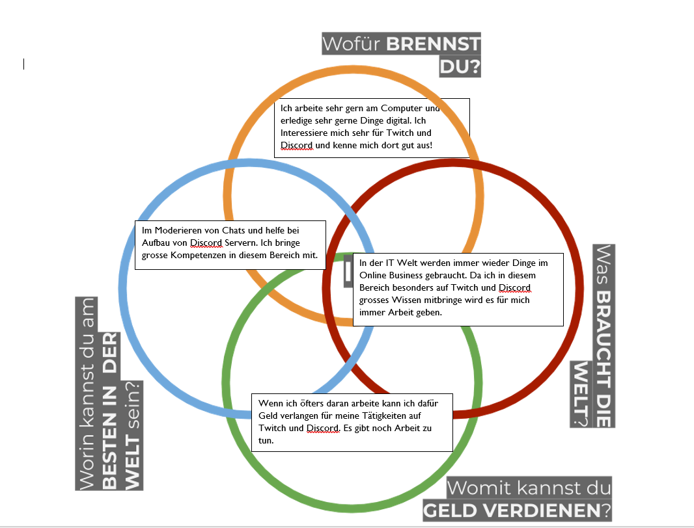
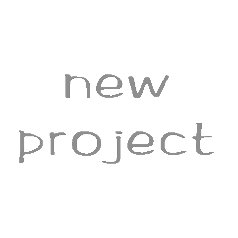

+++
title = "Semester 2"
date = "2022-02-15"
draft = false
pinned = false
tags = []
image = "pro.gif"
description = "Heute viel der Startschuss für das zweite Semester im Fach WEB. Ich bin gespannt wie sich mein Projekt in diesem Semester entwickeln wird und ob ich meine Ziele erreichen werde."
+++
# Mein Projekt im 2ten Semester

In diesem Semester will ich mich Rund um das Thema Discord und Twitch befassen. Aktuell bin ich Moderator eines eher kleineren Streamers auf Twitch. Dort moderiere ich den Chat und sorge für Recht und Ordnung. Ihr fragt euch jetzt sicher wie kam es dazu?

Der Streamer Stefan Wüthrich kenne ich aus unserer Schule. Wir haben bereits mehrere male als Klasse bei ihm in seinem Dojo trainiert. Eines Tages stiess ich auf eine Instagram-Story von ihm, indem ein Link zu seinem Twitch Kanal war. Anschliessend schaute ich ein paar Mal zu und beteiligte mich aktiv am Chat. Kurzezeit später nahm ich privat mit ihm Kontakt auf um ihm einige Verbesserungsvorschläge bezüglich seines Streames zu machen. Nach kurzem hin und her schreiben war es so weit und ich erhielt Nachricht das ich nun offiziell der Moderator seinen Twitch Kanales bin.

Ein paar Wochen später kontaktierte er mich und fragte mich, inwiefern ich Ahnung von Discord habe. Ich antwortete rasch und sagte, dass ich über einige Kenntnisse verfüge. Daraufhin erhielt ich den Auftrag seinen bisher bestehenden Discordserver zu überarbeiten und einige Wünsche von Ihm einzubauen. Im Nachhinein wäre das eine gute Möglichkeit gewesen für meine Arbeit entlohnt zu werden, doch ich habe es verpasst.

In der heutigen Lektion haben wir uns mit IKIGAI befasst. *Was IKIGAI? Noch nie gehört!?* Das selbe dachte ich mir auch, als ich das gehört habe. 

**Ikigai** beschreibt eine Methode, deren Ziel es ist, sich selbst näher kennenzulernen, um so die Dinge herauszufinden, die elementar für das eigene Glück im Leben sind. Konkret geht es um vier Teilbereiche: Berufung, Profession, Mission und Leidenschaft.

Wir haben das auf unser Projekt angewendent und uns auf vier Teilbereiche festgelegt. **Wofür brennst du? Was braucht die Welt? Womit kann mich Geld verdienen? Worin kann ich am besten der Welt sein?**

Das aufgefüllte IKIGAI sah bei mir wie folgt aus:

 Ich fand die heutige Lektion sehr spannend und bin gespannt wo mich mein Projekt noch hinführen wird.

