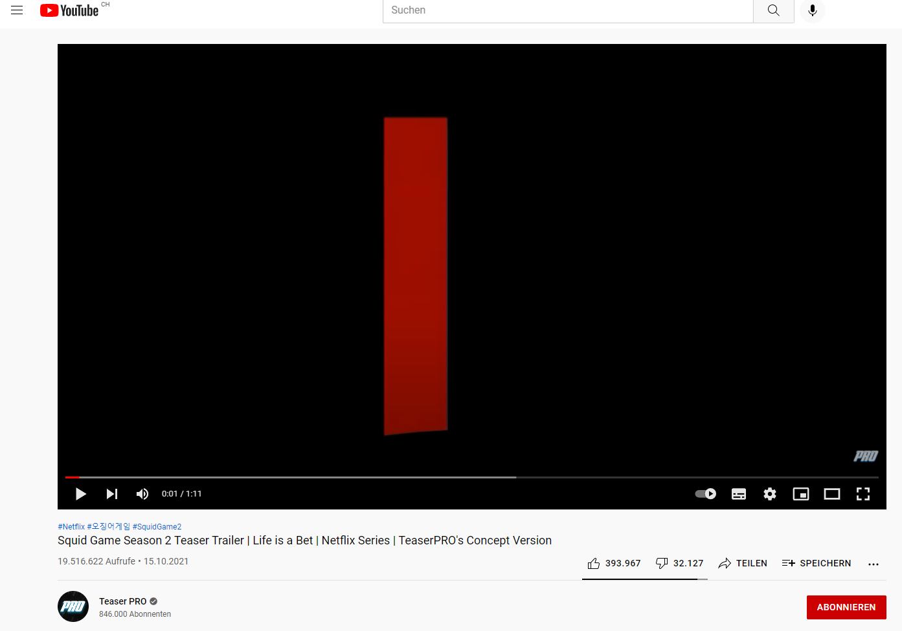
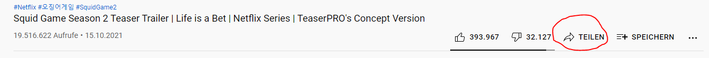
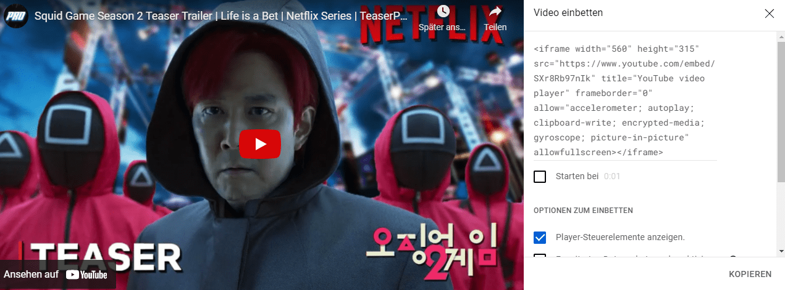
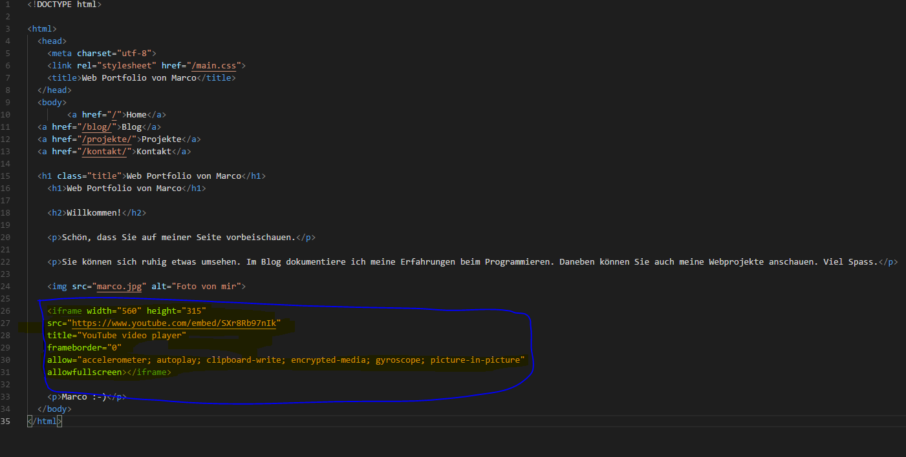
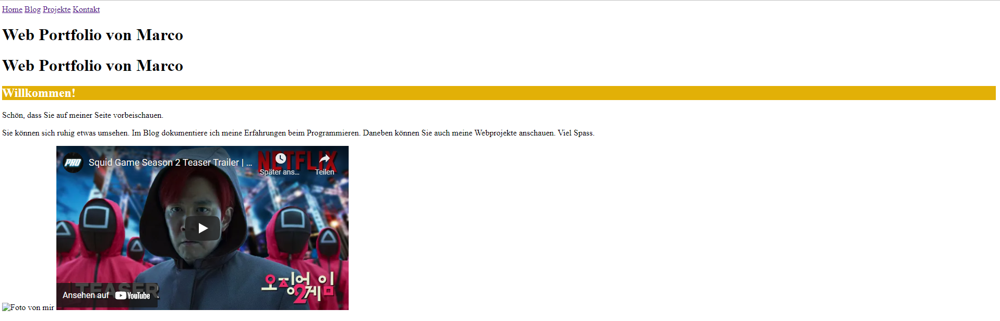

+++
title = "Video auf meiner ersten eigenen Webseite einfügen"
date = "2021-11-02"
draft = false
pinned = false
image = "video-1606945_1280-45a4223c58cb314c.png"
description = "Heute habe ich wieder an meiner Webseite gearbeitet und konnte so mein Wissen festigen und vertiefen. Zudem habe ich heute erfahren wie ich ein Video von YouTube in meine Webseite einbinden."
+++
# Wie binde ich ein Video in meine Webseite ein?

Diese Frage stellte ich mir zu Beginn der heutigen Lektion. Nach einem kurzen Fachinput von Marco, wo er nochmals alle Basic und Inhalte der ersten Tutorials zusammengefasst hat, habe ich Ihm diese Frage gestellt, welche er mir auch umgehend beantwortete.

1. Als erstes suchen wir das gewünschte Video auf YouTube

   
2. Anschliessend klicken wir auf Teilen

   
3. Danach klickt man auf "Einbetten" und es wird ein HTML-Code generiert, welchen den nötigen Link beinhaltet

   
4. Letztendlich kann man den generierten Code kopieren und in Visual Studio einfügen. Das sieht dann wie folgt aus:

   

   Um zu kontrollieren ob es funktioniert hat, kann man die Webseite auf dem Live Server generieren. Das sollte dann in etwa so aussehen:

   

   ## Wie sieht es mit unserem Projekt aus?

   Aktuell bin ich noch auf der Suche nach einer neuen Projekt Idee.....

   

   Bin aber fest davon überzeugt das es nächsten Mal klappt!

Bis bald!