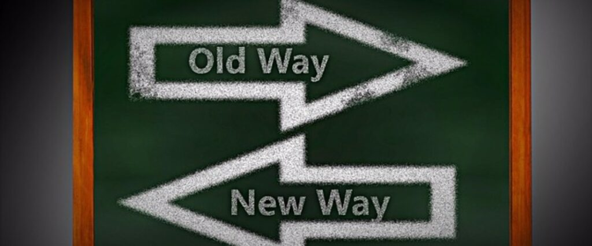
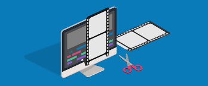

+++
title = "Vorsetzung meines Projektes"
date = "2021-11-16"
draft = true
pinned = false
image = "360_f_52404413_4giy6ke3iagg323unocxqalrhl79vddp.jpg"
description = "Heute habe ich an meinem Projekt weitergearbeitet!"
+++
# Der Weg ist das Ziel!

Heute habe ich mir Gedanken dazu gemacht wie ich mein Projekt am besten umsetzten kann. Dabei stellte ich mir folgende Fragen:

1. Welche Hilfsmittel benötige ich?
2. Welche Fähigkeiten muss ich mir aneignen?
3. Wie möchte ich das ganze angehen?
4. Worauf will ich den Fokus legen?

Ich habe mich dazu entschieden zuerst ein kurzen Werbeclip respektive ein kleines Making-Off des Backens zu machen und danach mich erst um eine Webseite für die Kundin zu kümmern. Zu diesem Entschluss kam ich, da ich in letzter Zeit viel mit Webseiten gearbeitet habe und gerne mal wieder etwas anders machen würde.

Zudem finde ich es sehr spannend mein Wissen im Bereich Videoediting zu verbessern, da ich sehr interessiert in diesem Thema bin. Jedoch muss ich mir noch einiges neues Wissen aneignen, damit mein Projekt erfolgreich durchgeführt werden kann.

Ich hoffe das ich alles so umsetzen kann wie ich es mir vorstelle. Ich bin sehr gespannt wie das Endergebnis aussehen wird und freue mich aufs nächste mal WEB in 2 Wochen!

\*Ich danke dir falls du diesen Blog bis hierhin durchgelesen hast <3

Auf wiedersehen!

