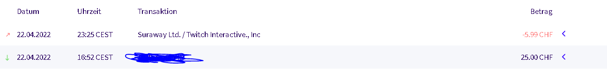

+++
title = "Weiterarbeit an meinem Projekt während den Frühlingsferien"
date = "2022-04-30"
draft = true
pinned = false
image = "1.jpg"
description = "Im heutigen Blogeintrag werde ich euch davon erzählen, was sich während den Frühlingsferien an meinem Projekt getan hat. Kleiner Spoiler: Es ist sehr viel passiert während den Ferien und ich bin sehr glücklich darüber."
+++
# Das Warten hat sich gelohnt!

Während den Ferien habe ich fleissig versucht einen neuen Kunden zu finden. Dies gestaltete sich ausnahmsweise äusserst einfach. Nach kurzem herumfragen und recherchieren hatte ich bereits einen Kunden gefunden. Es handelt sich dabei um einen bekannten von meinem bisherigen Kunden. Mein bisheriger Kunde hat also für mich geworben und den Kontakt hergestellt. 

Anschliessend sind wir kurz über Discord zusammengesessen und haben besprochen was er auf seinem Server alles haben will. Der Discord Server den ich für meinen vorherigen Kunden erstellt habe, war hierbei von grossem Nutzen. Anhand von diesem Server konnte ich zeigen was ich bereits gemacht habe und so konnten gewisse Sachen übernommen werden, sowie auch Anpassungen gemacht werden.

Danach haben wir uns noch auf einen Preis geeinigt. Diesmal war es mir sehr wichtig das ich auch einen Finanziellen Erlös aus dem ganzen ziehen kann. Deshalb habe ich einen Preis Vorschlag von 25 CHF gemacht. Der Kunde war damit einverstanden und so haben wir uns geeinigt.

Der Beweis für die Überweisung seht ihr hier:

Nachdem der Discord Server fertiggestellt war, habe ich diesen an den Kunden überreicht. Er war sehr zufrieden mit der Arbeit und so musste ich keine Anpassungen mehr vornehmen. Ich habe ihn daraufhin noch um ein kleines Feedback für meine Arbeit gefragt, damit ich dies als Referenz für die Zukunft verwenden kann.

Das Feedback sah wie folgt aus:

Ich muss ehrlich gesagt zugeben, dass es mir während den Ferien grosse Freude bereitet hat am Projekt zu arbeiten, denn erstmals hat man auch gesehen, dass all das was man macht auch einen gewissen Ertrag mit sich bringt. Es war ein tolles Erfolgserlebnis. 

Was ich definitiv gelernt habe, ist, für eine erbrachte Leistung auch nach einem entsprechenden Lohn zu fragen. Dies ist eine tolle Erfahrung, welche definitiv auch für das weitere Leben von grosser Nützlichkeit ist.

Ich hoffe ich konnte euch auf spannende Weise von meinem Projekt berichten und ihr konntet meine Gedanken und Gefühle während des Projektes einigermassen nachvollziehen.

Der nächste Blogeintrag erschein am 10. Mai. An diesem Tag werde ich die Präsentation über mein Projekt im Unterricht WEB halten.

Bis bald